# CogScale: Scalable Benchmark for Sequence Processing

A lightweight, fully synthetic benchmark designed as a cognitive "sanity check" for evaluating the sequence modeling capabilities of neural networks. CogScale isolates specific cognitive and memory abilities to let you rapidly validate architectural innovations before committing to massive, environmentally costly large-scale training.

## 🚀 Features

- **14 Diverse Tasks**: Signal Forecasting, Memory & Retention, Pattern Recognition, and Manipulation & Reasoning.
- **Parametrizable Scalability**: Test architectures across different difficulty levels (Small, Medium, Large) by scaling sequence lengths, delays, and vocabulary sizes.
- **Unified Interface**: Consistent API across all tasks with standardized evaluation metrics (MSE, Error Rate).
- **Zero Disk Storage**: Data is generated dynamically during training, bypassing loading bottlenecks and preventing simple memorization.
- **Strict Baseline Evaluation**: Evaluate how your model compares against established architectures (Transformers, Mamba, xLSTM, LSTM, GRU, ESN) under strict parameter budgets.

## 📊 Baseline Performances: The Cognitive Radar

We provide a solid baseline by evaluating 7 distinct architectures under strict parameter budgets (1k, 10k, and 100k). The **Cognitive Radar** visualizes their peak performances (accuracy) across a selective subset of tasks and scales, demonstrating how attention models (Transfomers) and state space models (Mamba) maintain robust reasoning under increased cognitive loads, while simple reservoir models (ESN) offer striking efficiency for basic retention tasks at an ultra-low parameter scale.
<center>
    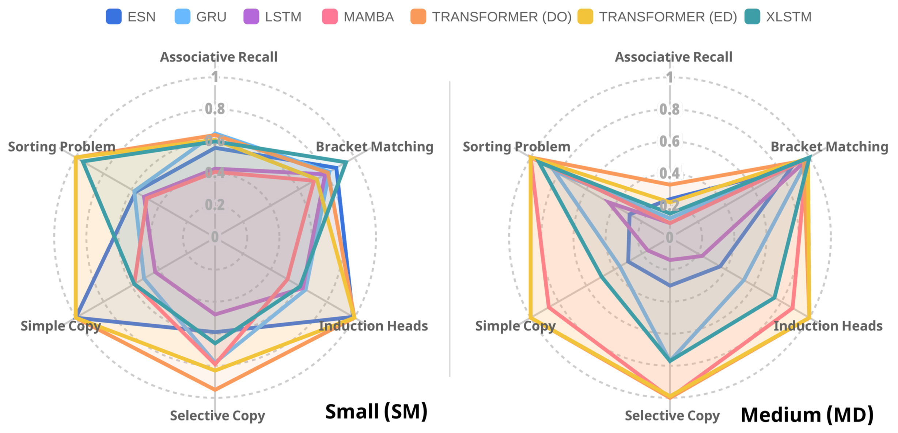   
</center >

*(See the paper for detailed insights on scalability and parameter efficiency).*

## 📦 Installation
```bash
pip install cogscale
```

Or install from source:

```bash
git clone [https://github.com/Naowak/cogscale.git](https://github.com/Naowak/cogscale.git)
cd cogscale
pip install -e .
```

## 🎯 Quick Start

```python
import cogscale as cog

# Build a task
task_data = cog.build_task('simple_copy', difficulty='small', seed=42)

# Access the dynamically generated data
X_train = task_data['X_train']  # Training inputs
Y_train = task_data['Y_train']  # Training targets
T_train = task_data['T_train']  # Prediction timesteps

# Train your model (example with dummy predictions)
Y_pred = your_model.predict(X_train)

# Evaluate performance using the unified metric
score = cog.compute_score(
    Y=Y_train, 
    Y_hat=Y_pred, 
    prediction_timesteps=T_train,
    category=task_data['category']
)
print(f"Score: {score}")
```


## 📚 Available Tasks

### 1. Signal Processing and Forecasting

#### `sinus_forecasting`:
Predict the future evolution of a sinusoidal signal.

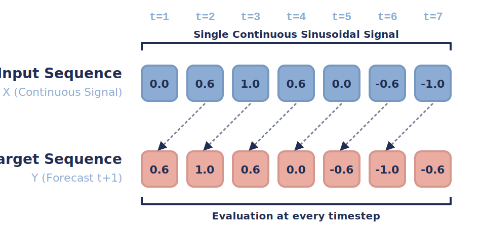

#### `chaotic_forecasting`:
Forecast the future state of a three-dimensional chaotic Lorenz system.

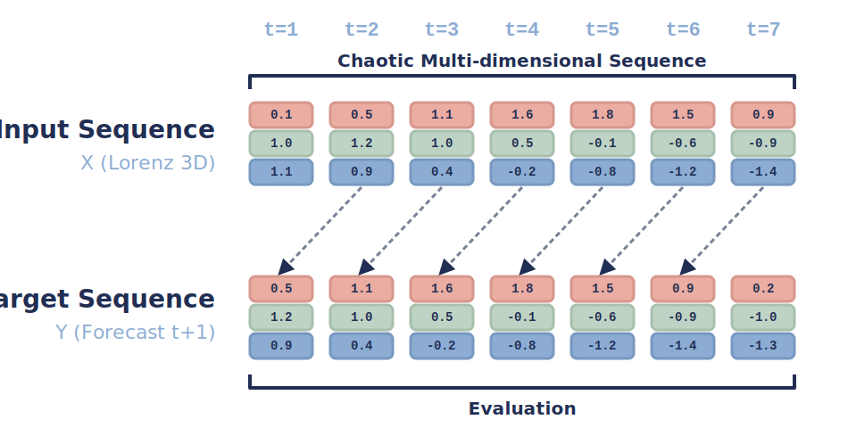

---

### 2. Memory and Retention

#### `discrete_postcasting`:
Reproduce a discrete sequence identically after a specified time shift.

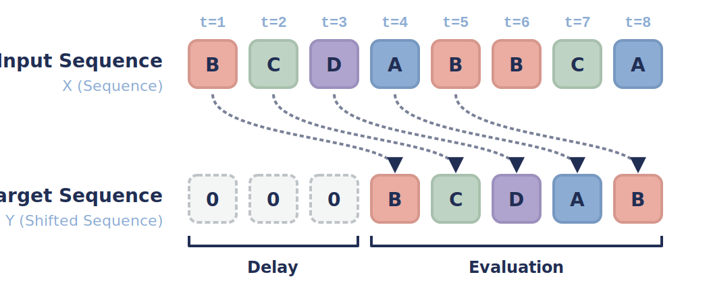

#### `continuous_postcasting`:
Reproduce a continuous sequence identically after a specified time shift.

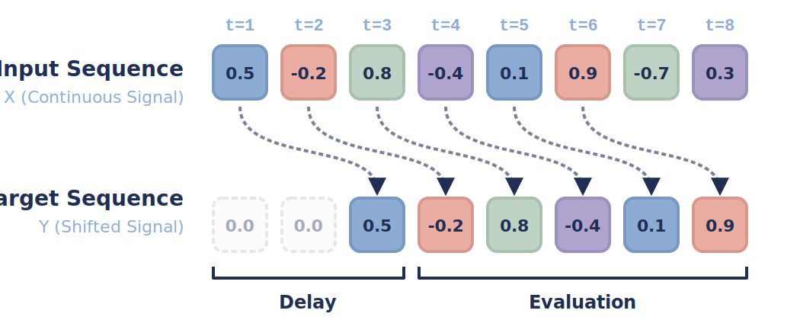

#### `simple_copy`:
Read a sequence, hold it in memory during a silent delay, and reproduce it after a trigger token.

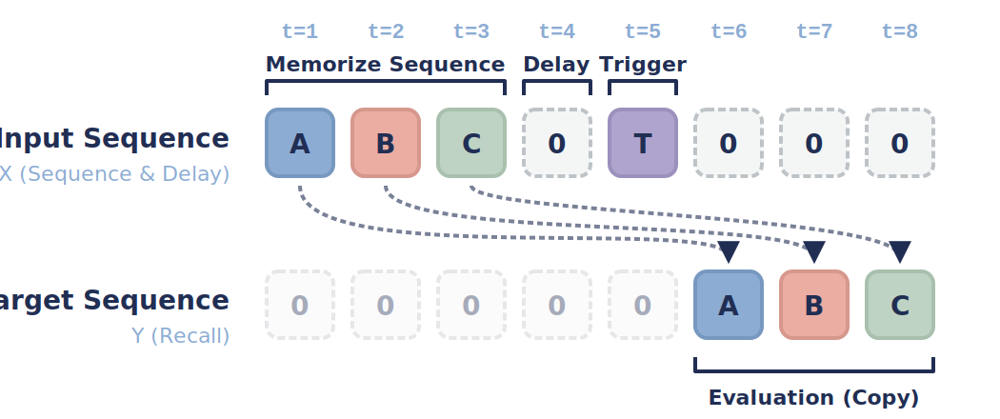

#### `selective_copy`:
Memorize only a specific subset of marked tokens amidst distractions and output them at the end.

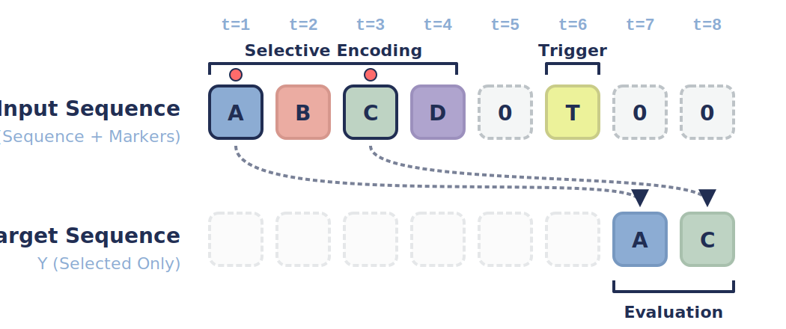

#### `associative_recall`:
Memorize a sequence of key-value pairs and retrieve the correct value when queried with a seen key.

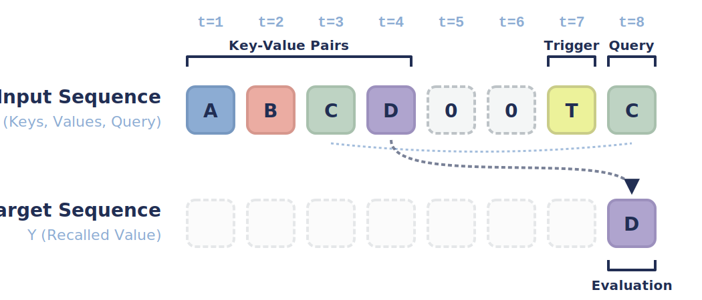

---

### 3. Pattern Recognition and Completion

#### `discrete_pattern_completion`:
Identify and infer missing components within a masked discrete periodic motif.

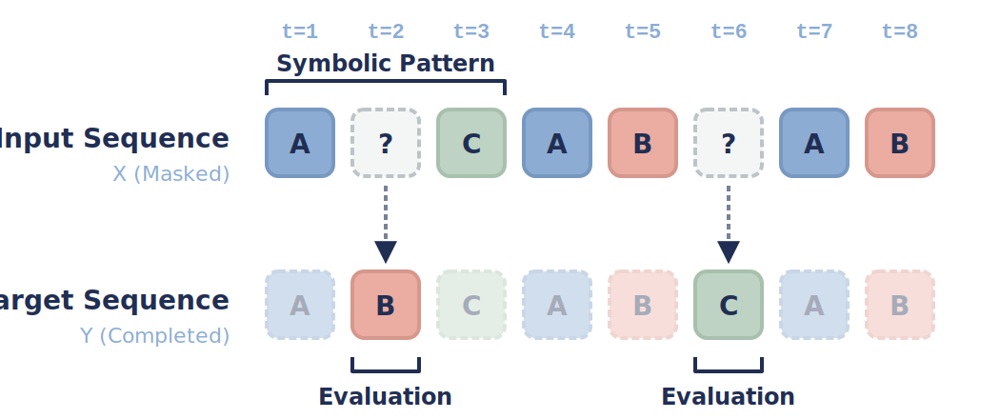

#### `continuous_pattern_completion`:
Identify and infer missing components within a masked continuous periodic motif.

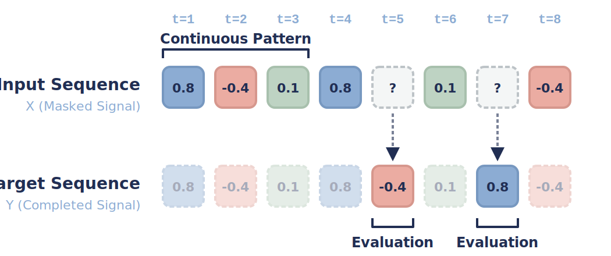

#### `induction_heads`:
Recognize in-context duplicated sequence structures to predict the next token.

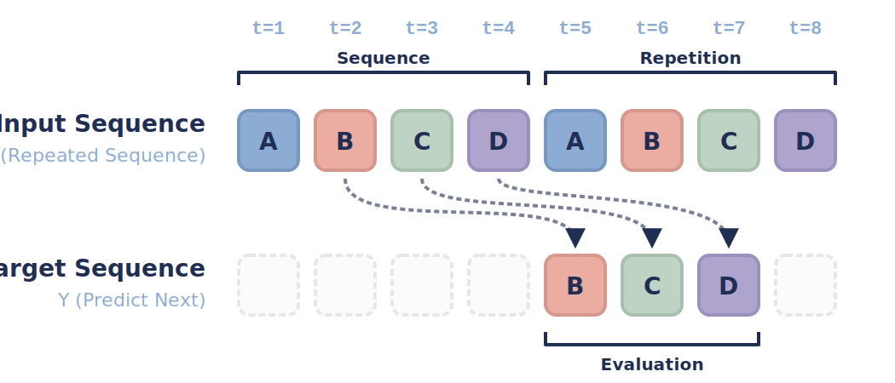

---

### 4. Reasoning and Algorithmic Manipulation

#### `adding_problem`:
Compute and output the sum of only the marked numbers within a random sequence.

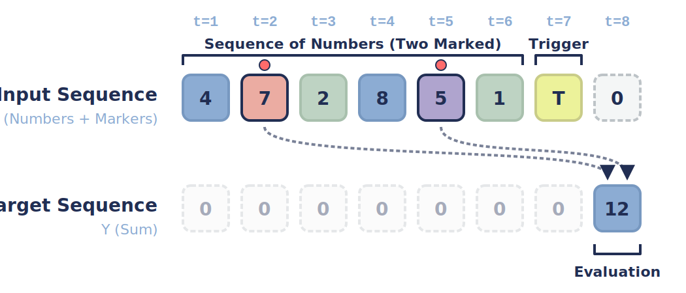

#### `sorting_problem`:
Output a randomized sequence sorted into the correct positional order after a trigger.

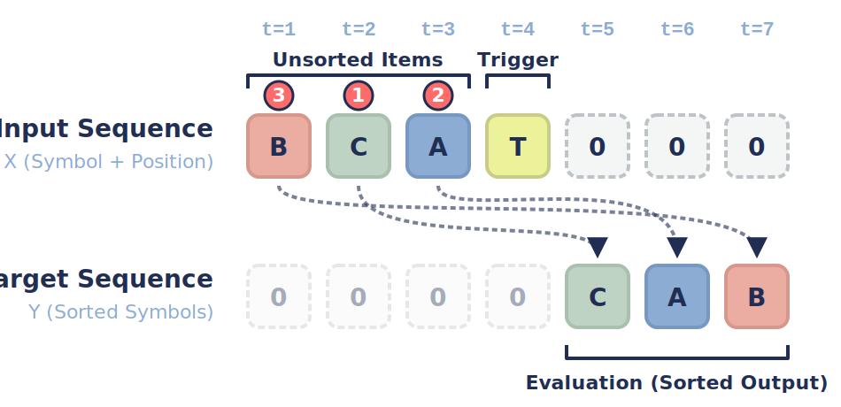

#### `bracket_matching`:
Determine if a mutated string of parentheses represents a valid hierarchy.

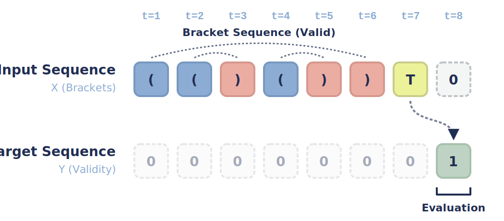

#### `cross_situation`:
Infer logical roles and attributes (objects, colors, positions) from a simplified natural language reasoning problem encoded in one-hot vectors.

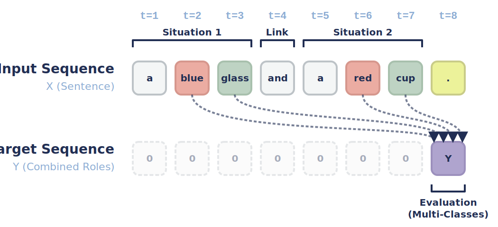

***

## 🔧 Task Configuration

Each task supports three modular difficulty levels, designed to verify if scaling a model's parameters genuinely translates to better cognitive capabilities:

### Small (`SM`)
- Reduced sequence lengths, delays, and vocabulary sizes.
- Ideal for quick experiments, debugging, and testing models at the **1k-10k parameter** scale.

### Medium (`MD`)
- Realistic problem sizes with increased cognitive load.
- Suitable for thorough model evaluation and scalability testing at the **10k-100k parameter** scale.

### Large (`LG`)
- Highly complex configurations.
- Designed to push high-performance and large-scale architectures to their representational limits.

```python
# Small configuration (fast & lightweight)
task_small = cog.build_task('bracket_matching', difficulty='small')

# Medium configuration (thorough scalability test)
task_medium = cog.build_task('bracket_matching', difficulty='medium')
```

## 📊 Data Format

All tasks return a standardized dictionary containing NumPy arrays:

```python
{
    'X_train': np.ndarray,      # Training inputs [batch, time, features]
    'Y_train': np.ndarray,      # Training targets [batch, time, outputs]
    'T_train': np.ndarray,      # Training prediction timesteps [batch, n_predictions]
    'X_valid': np.ndarray,      # Validation inputs
    'Y_valid': np.ndarray,      # Validation targets  
    'T_valid': np.ndarray,      # Validation prediction timesteps
    'X_test': np.ndarray,       # Test inputs
    'Y_test': np.ndarray,       # Test targets
    'T_test': np.ndarray,       # Test prediction timesteps
    'category': str             # 'classification', 'multi_classification', or 'regression'
}
```

## 🎨 Example: Complete Evaluation Pipeline

```python
import cogscale as cog
from MyModel import MyModel

def evaluate_model_on_all_tasks(model, difficulty='small'):
    """Evaluate an architecture across the full CogScale cognitive spectrum."""
    
    results = {}
    task_names = [
        'sinus_forecasting', 'chaotic_forecasting',
        'discrete_postcasting', 'continuous_postcasting', 
        'simple_copy', 'selective_copy', 'associative_recall',
        'discrete_pattern_completion', 'continuous_pattern_completion', 'induction_heads',
        'adding_problem', 'sorting_problem', 'bracket_matching', 'cross_situation'
    ]
    
    for task_name in task_names:
        print(f"Evaluating on {task_name}...")
        
        # Load dynamically generated task
        task_data = cog.build_task(task_name, difficulty=difficulty)
        
        # Train model
        model = MyModel(...)
        model.train(task_data['X_train'], task_data['Y_train'], task_data['T_train'])

        # Predict on test set
        Y_pred = model.predict(task_data['X_test'])
        
        # Compute unified score
        score = cog.compute_score(
            Y=task_data['Y_test'],
            Y_hat=Y_pred,
            prediction_timesteps=task_data['T_test'],
            category=task_data['category']
        )
        
        results[task_name] = score
        print(f"  Score: {score:.4f}")
    
    return results
```

## 📈 Evaluation Metrics

The evaluation metrics automatically adapt based on the task category:
- **Regression tasks**: Mean Squared Error (MSE)
- **Classification tasks**: Error rate (1 - accuracy)
- **Multi-class classification tasks**: Label-based error rate (1 - label-based accuracy)

*Lower scores indicate better performance across all tasks.*

## 📄 License

This project is licensed under the MIT License - see the [LICENSE](LICENSE) file for details.

## 📚 Citation

If you use CogScale in your research or find it helpful as a sanity check for your architectures, please cite:

```bibtex
@inproceedings{cogscale2026,
  title={CogScale: Scalable Benchmark for Sequence Processing},
  author={Bendi-Ouis Yannis, De Coudenhove Romain and Hinaut Xavier},
  year={2026},
  url={https://github.com/Naowak/cogscale}
}
```


## 📞 Support

- 🐛 Issues: [GitHub Issues](https://github.com/Naowak/cogscale/issues)
- 💬 Discussions: [GitHub Discussions](https://github.com/Naowak/cogscale/discussions)

---

*CogScale - Democratizing architectural research by ensuring foundational cognitive abilities before massive scaling.*
